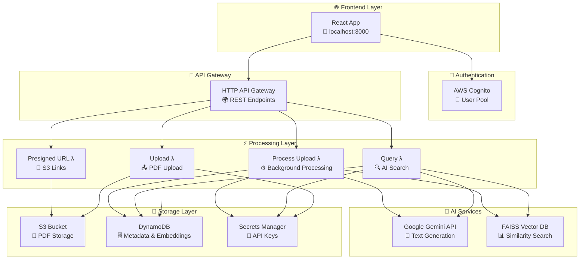
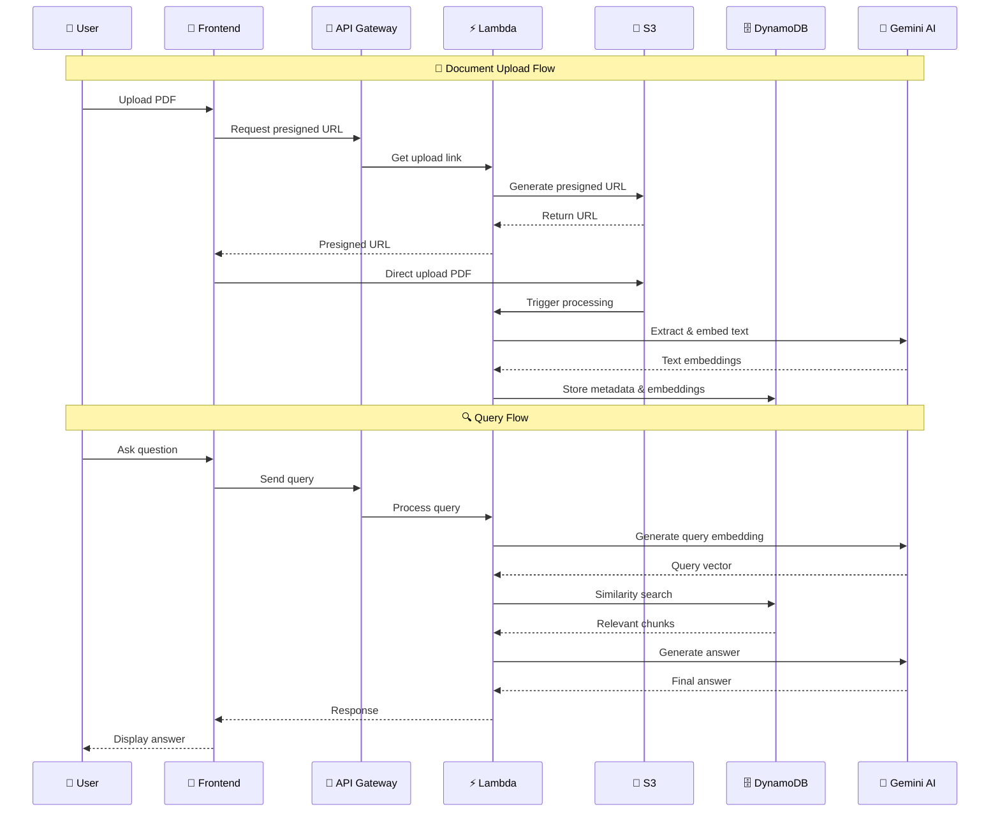

# 🚀 Personal AI Knowledge Platform (PAI)

<div align="center">


**🎯 Transform your PDF documents into an intelligent, searchable knowledge base using AI**

[📖 Quick Start](#-quick-start) • [🏗️ Architecture](#️-architecture) • [🔧 Manual Setup](#-manual-setup) • [❓ Troubleshooting](#-troubleshooting)

</div>

---

## 📋 Table of Contents

- [🌟 Features](#-features)
- [🏗️ Architecture](#️-architecture)
- [🚀 Quick Start](#-quick-start)
- [📋 Prerequisites](#-prerequisites)
- [🔧 Manual Setup](#-manual-setup)
- [📱 Usage Guide](#-usage-guide)
- [🛠️ Troubleshooting](#️-troubleshooting)
- [💰 Cost Optimization](#-cost-optimization)
- [🔒 Security](#-security)
- [🤝 Contributing](#-contributing)

---

## 🌟 Features

<div align="center">

| 📄 **PDF Processing** | 🧠 **AI-Powered Search** | 🔐 **Secure Authentication** | ☁️ **Cloud Native** |
|:---:|:---:|:---:|:---:|
| Upload and extract text from PDFs | Natural language queries using Gemini AI | JWT-based auth via AWS Cognito | Serverless architecture on AWS |
| Automatic text chunking | Vector similarity search with FAISS | User registration & login | Auto-scaling Lambda functions |
| Metadata extraction | Semantic understanding | Session management | Pay-per-use pricing |

</div>

### ✨ Key Capabilities

- 📥 **Smart Document Upload**: Direct-to-S3 upload with presigned URLs (supports files up to 5GB)
- 🔍 **Intelligent Search**: Ask questions in natural language and get accurate answers from your documents
- 🧮 **Vector Embeddings**: Advanced FAISS-based similarity search for contextual understanding
- 🔄 **Real-time Processing**: Background document processing with status updates
- 📊 **User Dashboard**: Manage your document collection with an intuitive React interface
- 🛡️ **Enterprise Security**: AWS Cognito authentication with JWT tokens
- 📈 **Scalable Architecture**: Serverless design that scales from 0 to millions of requests

---

## 🏗️ Architecture

<div align="center">



</div>

### 🔄 Data Flow



---

## 🚀 Quick Start

### 🎯 One-Command Deployment

The fastest way to get started is using our automated deployment script:

```bash
# 1️⃣ Clone the repository
git clone <your-repo-url>
cd cc-internship

# 2️⃣ Configure your API key
# Edit deploy.sh and replace YOUR_GEMINI_KEY_HERE with your actual Gemini API key
nano deploy.sh  # Line 27: GEMINI_API_KEY="your_actual_key_here"

# 3️⃣ Make the script executable
chmod +x deploy.sh

# 4️⃣ Deploy everything (takes 5-10 minutes)
./deploy.sh
```

**🎉 That's it!** The script will:
- ✅ Create all AWS resources (IAM, S3, DynamoDB, Cognito, Lambda, API Gateway)
- ✅ Deploy Lambda functions with proper configurations
- ✅ Set up the React frontend with environment variables
- ✅ Start the development server at `http://localhost:3000`

### 📊 Deployment Status

After running the deployment script, you'll see a status summary:

```
==================================
    DEPLOYMENT SUMMARY
==================================
IAM: ✅
Secrets: ✅
S3: ✅
DynamoDB: ✅
Cognito: ✅
Lambda: ✅
API Gateway: ✅
Dependencies: ✅
==================================
🎉 Frontend started at http://localhost:3000
```

---

## 📋 Prerequisites

### 🛠️ Required Tools

Before running the deployment script, ensure you have:

| Tool | Version | Purpose | Installation |
|------|---------|---------|--------------|
| 🐍 **Python** | 3.12+ | Lambda runtime | [Download](https://python.org/downloads) |
| ☁️ **AWS CLI** | Latest | AWS resource management | `pip install awscli` |
| 🔨 **SAM CLI** | Latest | Serverless deployment | [Install Guide](https://docs.aws.amazon.com/serverless-application-model/latest/developerguide/serverless-sam-cli-install.html) |
| 📦 **Node.js** | 16+ | React frontend | [Download](https://nodejs.org) |
| 📊 **jq** | Latest | JSON parsing | `apt install jq` / `brew install jq` |
| 📁 **zip** | Latest | Lambda packaging | Pre-installed on most systems |

### 🔑 AWS Setup

1. **Create AWS Account** (if you don't have one)
2. **Configure AWS CLI**:
   ```bash
   aws configure
   # Enter your Access Key ID, Secret Access Key, Region (ap-south-1), Output format (json)
   ```
3. **Get Gemini API Key** from [Google AI Studio](https://makersuite.google.com/app/apikey)

### ✅ Prerequisites Check

Run this command to verify your setup:

```bash
# Check all required tools
for tool in python3 aws sam node npm jq zip; do
    if command -v $tool &> /dev/null; then
        echo "✅ $tool: $(command -v $tool)"
    else
        echo "❌ $tool: Not found"
    fi
done

# Check AWS configuration
aws sts get-caller-identity
```

---

## 🔧 Manual Setup

If you prefer manual deployment or need to troubleshoot, follow these detailed steps:

### 🏗️ Infrastructure Setup

<details>
<summary>📂 <strong>Step 1: Project Structure</strong></summary>

```
cc-internship/
├── 📁 backend/                    # Lambda functions
│   ├── 📁 upload/                 # PDF upload handler
│   ├── 📁 query/                  # AI query processor
│   ├── 📁 presigned-url/          # S3 URL generator
│   └── 📁 process-upload/         # Background processor
├── 📁 frontend/                   # React application
│   ├── 📁 src/                    # Source code
│   └── 📄 package.json            # Dependencies
├── 📁 infra/                      # SAM template
│   └── 📄 template.yaml           # Infrastructure as code
├── 🚀 deploy.sh                   # Automated deployment
├── 🗑️ teardown.sh                 # Resource cleanup
└── 📖 REDEPLOY.md                 # Manual deployment guide
```

</details>

<details>
<summary>🔐 <strong>Step 2: IAM User Creation</strong></summary>

```bash
# Create deployment user
aws iam create-user --user-name pai-deployment-user

# Create access key
aws iam create-access-key --user-name pai-deployment-user

# Create policy
cat > pai-deployment-policy.json << 'EOF'
{
    "Version": "2012-10-17",
    "Statement": [
        {
            "Effect": "Allow",
            "Action": [
                "cloudformation:*", "s3:*", "lambda:*",
                "apigateway:*", "dynamodb:*", "cognito-idp:*",
                "iam:GetRole", "iam:CreateRole", "iam:AttachRolePolicy",
                "iam:PassRole", "secretsmanager:*", "logs:*"
            ],
            "Resource": "*"
        }
    ]
}
EOF

# Attach policy
aws iam create-policy --policy-name pai-deployment-policy --policy-document file://pai-deployment-policy.json
aws iam attach-user-policy --user-name pai-deployment-user --policy-arn arn:aws:iam::ACCOUNT:policy/pai-deployment-policy
```

</details>

<details>
<summary>🔒 <strong>Step 3: Secrets Management</strong></summary>

```bash
# Store Gemini API key securely
aws secretsmanager create-secret \
    --name pai-gemini-api-key \
    --description "Gemini API key for PAI platform" \
    --secret-string "YOUR_GEMINI_API_KEY" \
    --region ap-south-1

# Verify secret creation
aws secretsmanager describe-secret --secret-id pai-gemini-api-key --region ap-south-1
```

</details>

<details>
<summary>📦 <strong>Step 4: S3 Bucket Setup</strong></summary>

```bash
# Create bucket with timestamp for uniqueness
BUCKET_NAME="pai-pdf-storage-$(date +%s)"
aws s3 mb "s3://$BUCKET_NAME" --region ap-south-1

# Enable versioning
aws s3api put-bucket-versioning \
    --bucket $BUCKET_NAME \
    --versioning-configuration Status=Enabled

# Configure CORS for frontend uploads
aws s3api put-bucket-cors --bucket $BUCKET_NAME --cors-configuration '{
    "CORSRules": [{
        "AllowedHeaders": ["*"],
        "AllowedMethods": ["GET", "POST", "PUT"],
        "AllowedOrigins": ["*"],
        "ExposeHeaders": ["ETag"],
        "MaxAgeSeconds": 3000
    }]
}'
```

</details>

<details>
<summary>🗄️ <strong>Step 5: DynamoDB Table</strong></summary>

```bash
# Create table for embeddings and metadata
aws dynamodb create-table \
    --table-name pai-embeddings-metadata \
    --attribute-definitions AttributeName=doc_id,AttributeType=S \
    --key-schema AttributeName=doc_id,KeyType=HASH \
    --billing-mode PAY_PER_REQUEST \
    --region ap-south-1

# Wait for table to become active
aws dynamodb wait table-exists --table-name pai-embeddings-metadata --region ap-south-1
```

</details>

<details>
<summary>🔑 <strong>Step 6: Cognito User Pool</strong></summary>

```bash
# Create user pool
aws cognito-idp create-user-pool \
    --pool-name pai-user-pool \
    --policies '{"PasswordPolicy": {"MinimumLength": 8}}' \
    --auto-verified-attributes email \
    --alias-attributes email \
    --region ap-south-1

# Create app client (save the IDs)
aws cognito-idp create-user-pool-client \
    --user-pool-id YOUR_POOL_ID \
    --client-name pai-client \
    --no-generate-secret \
    --explicit-auth-flows ALLOW_USER_PASSWORD_AUTH ALLOW_REFRESH_TOKEN_AUTH \
    --region ap-south-1

# Create domain
aws cognito-idp create-user-pool-domain \
    --domain "pai-auth-$(date +%s)" \
    --user-pool-id YOUR_POOL_ID \
    --region ap-south-1
```

</details>

### ⚡ Lambda Deployment

<details>
<summary>🚀 <strong>SAM Deployment</strong></summary>

```bash
# Navigate to infrastructure directory
cd infra

# Build SAM application
sam build

# Deploy with guided setup
sam deploy --guided

# Or use automated deployment
sam deploy \
    --stack-name pai-stack \
    --s3-bucket your-deployment-bucket \
    --capabilities CAPABILITY_IAM \
    --region ap-south-1
```

</details>

### 🌐 Frontend Setup

<details>
<summary>⚙️ <strong>Environment Configuration</strong></summary>

```bash
# Navigate to frontend directory
cd frontend

# Create environment file
cat > .env << EOF
REACT_APP_API_URL=https://your-api-id.execute-api.ap-south-1.amazonaws.com
REACT_APP_COGNITO_USER_POOL_ID=ap-south-1_xxxxxxxxx
REACT_APP_COGNITO_USER_POOL_CLIENT_ID=xxxxxxxxxxxxxxxxxxxxxxxxxx
EOF

# Install dependencies
npm install --legacy-peer-deps

# Start development server
npm start
```

</details>

---

## 📱 Usage Guide

### 🎯 Getting Started

1. **🌐 Open your browser** and navigate to `http://localhost:3000`

2. **👤 Create an account**:
   - Click "Create Account"
   - Enter your email and password
   - Verify your email (check your inbox)

3. **📄 Upload your first document**:
   - Click "Upload PDF" or drag & drop
   - Wait for processing to complete
   - You'll see a success message when ready

4. **🔍 Start querying**:
   - Type your question in natural language
   - Example: "What are the main points discussed in this document?"
   - Get AI-powered answers instantly

### 💡 Usage Examples

| Query Type | Example Question | Expected Response |
|------------|------------------|-------------------|
| 📊 **Summarization** | "Summarize the main points of this document" | Structured summary with key highlights |
| 🔍 **Fact Finding** | "What is the budget mentioned for Q4?" | Specific numbers and context |
| 📈 **Analysis** | "What are the risks mentioned in the report?" | Risk analysis with details |
| 📋 **Lists** | "List all the recommendations made" | Bullet-pointed recommendations |

### 🎨 User Interface Guide

<details>
<summary>🖥️ <strong>Dashboard Overview</strong></summary>

```
┌─────────────────────────────────────────────┐
│  🚀 Personal AI Knowledge Platform          │
├─────────────────────────────────────────────┤
│  📤 Upload PDF    |    🔍 Search Documents  │
├─────────────────────────────────────────────┤
│  📁 My Documents  |    ⚙️ Settings         │
│  ┌─────────────┐  |    👤 Profile          │
│  │ Document 1  │  |    🚪 Logout           │
│  │ ✅ Processed │  |                        │
│  └─────────────┘  |                        │
└─────────────────────────────────────────────┘
```

</details>

---

## 🛠️ Troubleshooting

### 🚨 Common Issues & Solutions

<details>
<summary>❌ <strong>Deployment Fails</strong></summary>

**Issue**: CloudFormation deployment fails with transform errors

**Solution**:
```bash
# Check for SCP restrictions
aws iam simulate-principal-policy \
    --policy-source-arn arn:aws:iam::ACCOUNT:user/pai-deployment-user \
    --action-names cloudformation:CreateChangeSet \
    --resource-arns "arn:aws:cloudformation:ap-south-1:aws:transform/Serverless-2020-10-31"

# Use manual deployment as fallback
./deploy.sh  # Script automatically handles SCP issues
```

</details>

<details>
<summary>🔧 <strong>Lambda Function Errors</strong></summary>

**Issue**: Functions return "Internal Server Error"

**Solution**:
```bash
# Check function logs
aws logs describe-log-groups --log-group-name-prefix /aws/lambda/pai

# Fix common issues
./deploy.sh --fix-issues

# Update environment variables manually
aws lambda update-function-configuration \
    --function-name pai-query \
    --environment Variables='{
        "DYNAMODB_TABLE":"pai-embeddings-metadata",
        "GEMINI_SECRET_NAME":"pai-gemini-api-key"
    }'
```

</details>

<details>
<summary>🌐 <strong>Frontend Connection Issues</strong></summary>

**Issue**: Frontend can't connect to backend

**Solution**:
1. Check `.env` file in frontend directory
2. Verify API Gateway URL is correct
3. Check CORS configuration:
   ```bash
   aws apigatewayv2 get-api --api-id YOUR_API_ID
   ```
4. Test API directly:
   ```bash
   curl "https://your-api.execute-api.ap-south-1.amazonaws.com/presigned-url?filename=test.pdf"
   ```

</details>

<details>
<summary>📄 <strong>PDF Upload Issues</strong></summary>

**Issue**: Large files fail to upload

**Causes & Solutions**:
- **File > 2MB via API Gateway**: ✅ Uses S3 direct upload automatically
- **File > 50MB**: ✅ Supported via presigned URLs  
- **CORS errors**: Check S3 bucket CORS configuration
- **Timeout errors**: Large files process in background

</details>

### 🔍 Health Check Commands

```bash
# Run comprehensive health check
./deploy.sh --health-check

# Check individual services
aws lambda list-functions --query 'Functions[?contains(FunctionName, `pai`)]'
aws s3 ls | grep pai-pdf-storage
aws dynamodb list-tables --query 'TableNames[?contains(@, `pai`)]'
aws cognito-idp list-user-pools --max-results 20 --query 'UserPools[?contains(Name, `pai`)]'
```

### 🆘 Getting Help

| Issue Type | Action |
|------------|--------|
| 🚨 **Critical Error** | Check CloudWatch logs: `aws logs describe-log-groups --log-group-name-prefix /aws/lambda/pai` |
| ⚠️ **Performance** | Monitor DynamoDB and Lambda metrics in AWS Console |
| 🔧 **Configuration** | Run `./deploy.sh --fix-issues` for common problems |
| 📖 **Documentation** | Check `REDEPLOY.md` for detailed manual steps |

---

## 💰 Cost Optimization

### 💳 AWS Free Tier Usage

This project is designed to work within AWS Free Tier limits:

| Service | Free Tier Limit | Expected Usage |
|---------|-----------------|----------------|
| 🔧 **Lambda** | 1M requests/month | ~10K requests |
| 📦 **S3** | 5GB storage | ~1GB PDFs |
| 🗄️ **DynamoDB** | 25GB storage | ~100MB metadata |
| 🚪 **API Gateway** | 1M API calls | ~10K calls |
| 🔐 **Cognito** | 50K MAU | ~10 users |

### 📊 Cost Monitoring

```bash
# Enable cost monitoring
aws budgets create-budget --account-id ACCOUNT --budget '{
    "BudgetName": "PAI-Platform-Budget",
    "BudgetLimit": {"Amount": "5", "Unit": "USD"},
    "TimeUnit": "MONTHLY",
    "BudgetType": "COST"
}'
```

### 🎯 Optimization Tips

- 📄 **Document Limit**: Stay under 1000 documents for free tier
- 🔄 **Query Frequency**: Batch queries when possible
- 📁 **File Size**: Compress PDFs before upload
- 🗑️ **Cleanup**: Regularly delete unused documents

---

## 🔒 Security

### 🛡️ Security Features

- 🔐 **Authentication**: AWS Cognito with JWT tokens
- 🔑 **Authorization**: Per-user document isolation
- 🚪 **API Security**: CORS configured, API key protection
- 📁 **Data Encryption**: S3 and DynamoDB encryption at rest
- 🌐 **Network Security**: VPC endpoints for sensitive operations
- 🔒 **Secrets Management**: API keys stored in AWS Secrets Manager

### 🔧 Security Configuration

<details>
<summary>🔒 <strong>Enhanced Security Setup</strong></summary>

```bash
# Enable S3 encryption
aws s3api put-bucket-encryption \
    --bucket $BUCKET_NAME \
    --server-side-encryption-configuration '{
        "Rules": [{
            "ApplyServerSideEncryptionByDefault": {
                "SSEAlgorithm": "AES256"
            }
        }]
    }'

# Enable DynamoDB encryption
aws dynamodb update-table \
    --table-name pai-embeddings-metadata \
    --sse-specification Enabled=true

# Configure API Gateway throttling
aws apigatewayv2 update-stage \
    --api-id $API_ID \
    --stage-name '$default' \
    --throttle-settings BurstLimit=100,RateLimit=50
```

</details>

### ✅ Security Checklist

- [ ] 🔐 Cognito password policy enabled (8+ characters)
- [ ] 🚪 API Gateway CORS properly configured
- [ ] 📁 S3 bucket not publicly accessible
- [ ] 🔑 Secrets stored in AWS Secrets Manager
- [ ] 📊 CloudTrail logging enabled for auditing
- [ ] 🛡️ Lambda functions use least-privilege IAM roles

---

## 🤝 Contributing

### 🌟 How to Contribute

1. **🍴 Fork the repository**
2. **🌿 Create a feature branch**: `git checkout -b feature/amazing-feature`
3. **💾 Commit your changes**: `git commit -m 'Add amazing feature'`
4. **📤 Push to the branch**: `git push origin feature/amazing-feature`
5. **🔄 Open a Pull Request**

### 🐛 Bug Reports

When reporting bugs, please include:
- 📋 Steps to reproduce
- 💻 Expected vs actual behavior  
- 🖥️ Environment details (OS, browser, versions)
- 📄 Relevant logs or screenshots

### 💡 Feature Requests

We welcome suggestions for:
- 🔍 Enhanced search capabilities
- 📊 New document formats (Word, Excel, etc.)
- 🤖 Additional AI model integrations
- 🎨 UI/UX improvements

---

## 📞 Support & Resources

### 🔗 Quick Links

- 📖 **[Detailed Setup Guide](REDEPLOY.md)** - Step-by-step manual deployment
- 🗑️ **[Cleanup Guide](teardown.sh)** - Remove all AWS resources
- 🚀 **[Deployment Script](deploy.sh)** - Automated deployment tool
- 📊 **[Architecture Diagrams](#️-architecture)** - System overview

### 📧 Getting Help

| Need Help With | Contact Method |
|----------------|----------------|
| 🐛 **Bugs** | Open a GitHub issue with error details |
| 💡 **Features** | Start a GitHub discussion |
| 🔧 **Setup** | Check troubleshooting guide above |
| 💬 **General** | Create a GitHub discussion |

---

<div align="center">

## 🎉 Ready to Build Your AI Knowledge Platform?

**Choose your deployment method:**

[](README.md#-quick-start)
[](README.md#-manual-setup)
[](README.md#-health-check-commands)

**⭐ Star this repo if it helped you build something awesome!**

---

*Built with ❤️ using AWS, React, and AI*

</div>
